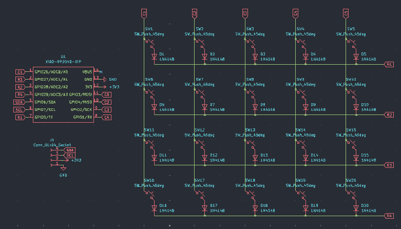
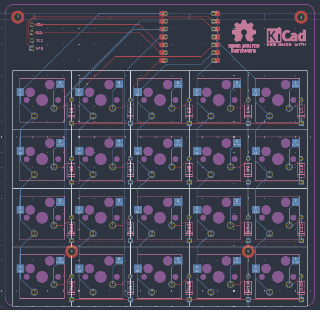
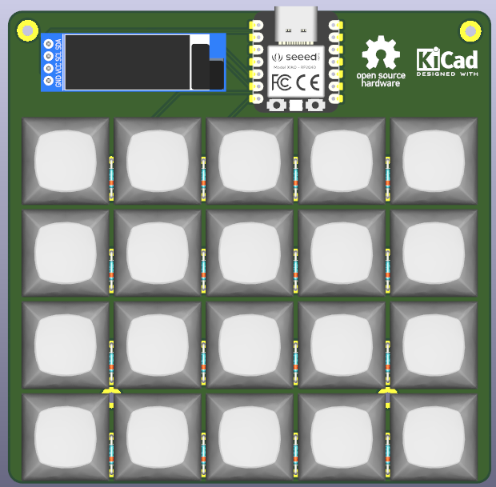
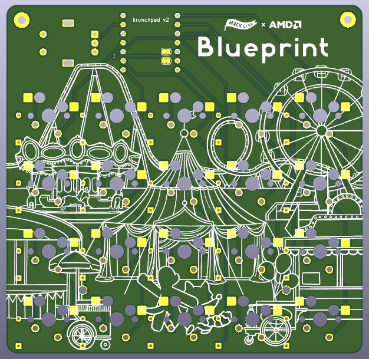

# krunchpad-20
A 20 key macro pad powered by RP2040 with KMK

Featuring an open-top design from the case and an OLED display for displaying key map.

# Images

| PCB | 3D Preview | Case |
|-----|------------|------|
|  |  |  |
| |  | |

